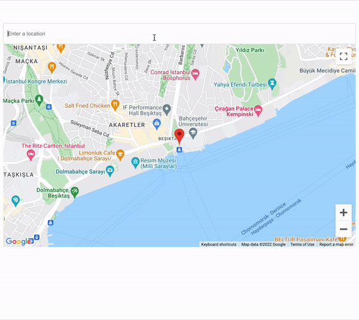
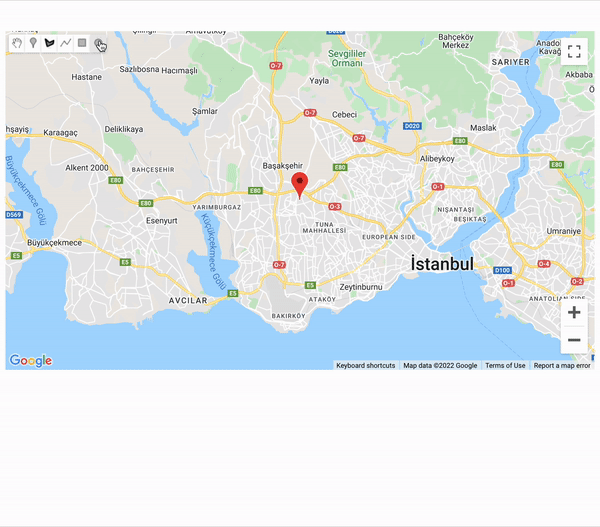

### 🗺 google-maps-loader-helper

##### This package is a helper for [@googlemaps/js-api-loader package](https://github.com/googlemaps/js-api-loader)



## Install Node Package

* ##### with yarn

```bash
yarn add google-maps-loader-helper
```

* ##### with npm

```bash
npm install google-maps-loader-helper
```
  

```javascript
  import GoogleMapLoader from 'google-maps-loader-helper'

  const GoogleMaps = new GoogleMapLoader(/*options*/)
```

### [Start Using](https://edisdev.github.io/google-maps-loader-helper)

